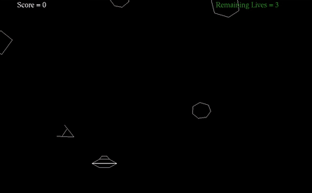

# Asteroids Game

The famous asteroid shooter game made with **C++** and **OpenGL**. This game was made for the semester project of course _Computer Programming_.

The objective of this project was to test the knowledge of OOP concepts learned in the course.

**Project Guidelines:** [pdf](assets/Asteroids.pdf)

 

Gameplay <strong>(GIF - 10 seconds)</strong>

    

